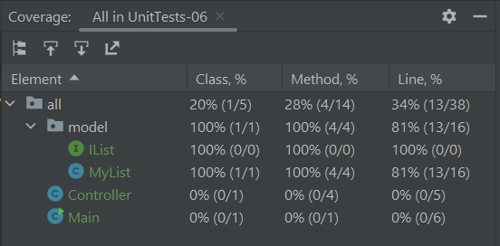

Задание 1. Создайте программу на Python или Java, которая принимает два списка чисел и выполняет следующие действия:
Рассчитывает среднее значение каждого списка.
Сравнивает эти средние значения и выводит сообщение:
«Первый список имеет большее среднее значение», если среднее значение первого списка больше.
«Второй список имеет большее среднее значение», если среднее значение второго большего списка.
«Средние значения равны», если средние значения списков равны.
Важно:
Приложение должно быть написано в соответствии с принципами объектно-ориентированного программирования. Используйте Pytest (для Python) или JUnit (для Java) для написания тестов, проверяющих правильность работы программы. Тесты должны учитывать различные сценарии использования вашего приложения. Используйте pylint (для Python) или Checkstyle (для Java) для проверки качества кода. Сгенерируйте отчет о покрытии тестовых кодов. Ваша цель - достичь минимум 90% покрытия.

Формат и требования к сдаче:
Отчет о выполнении этого задания должен включать в себя следующие элементы:

Код программы
Код испытаний
Отчет pylint/Checkstyle
Отчет о покрытии тестами
Объяснение того, какие сценарии покрыты тестами, и почему вы выбрали именно эти сценарии.
Ререхони
В качестве языка программирования для выполнения проекта выбрана Java. Приложение написано в соответствии с принципами объектно-ориентированного программирования. Код представлен в файле src -> main -> java, тесты к нему в файле test -> java.

Для написания тестов применяются библиотеки JUnit, Mockito. Над каждым тестом приводится краткая аннотация, содержащая информацию о типе теста и методе, которые он использовал ранее. Применил модуль и макетные тесты для методов проверки в классах MyList, Controller. Для тестирования параметров контроллера и моделей (интеграций) применил фреймворк Mockito для создания макетов-объектов. В качестве таблицы выбран случайный выбор.

Отчёт о покрытии кода тестами

Отчет о выполнении этого задания должен включать в себя следующие элементы:

Код программы
Код испытаний
Отчет pylint/Checkstyle
Отчет о покрытии тестами
Объяснение того, какие сценарии покрыты тестами, и почему вы выбрали именно эти сценарии.
Ререхони
В качестве языка программирования для выполнения проекта выбрана Java. Приложение написано в соответствии с принципами объектно-ориентированного программирования. Код представлен в файле src -> main -> java, тесты к нему в файле test -> java.

Для написания тестов применяются библиотеки JUnit, Mockito. Над каждым тестом приводится краткая аннотация, содержащая информацию о типе теста и методе, которые он использовал ранее. Применил модуль и макетные тесты для методов проверки в классах MyList, Controller. Для тестирования параметров контроллера и моделей (интеграций) применил фреймворк Mockito для создания макетов-объектов. В качестве таблицы выбран случайный выбор.

Отчёт о покрытии кода тестами

